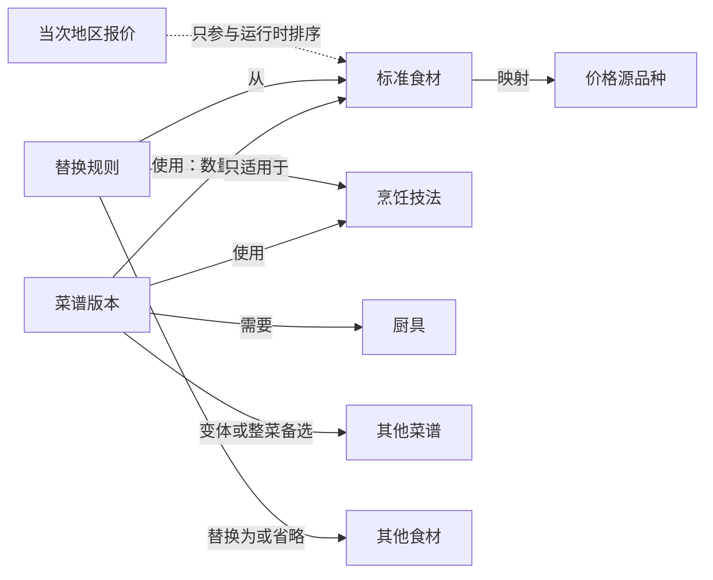
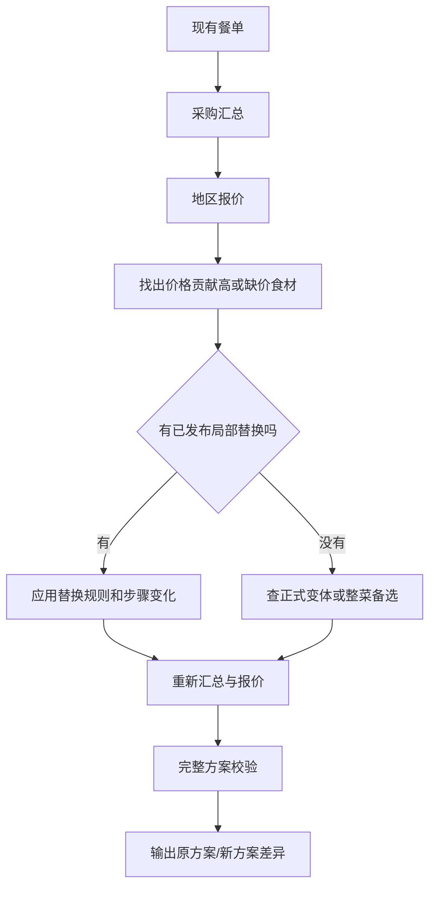
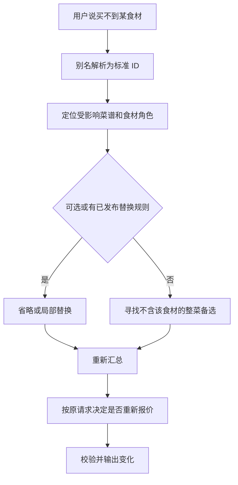

# Obsidian 菜谱知识库设计草图

本文是面向维护者的入门设计，不是已经发布的 schema。它解释知识库要存什么、文件怎样互相连接，以及用户提出”太贵”或”买不到”时系统如何利用这些知识。

> `PRD/AI原生菜谱Agent-PRD-V0.5.md`（状态：设计方向，未实施）认领了本文第 3、5 节”食材角色”部分的设计方向，并补充了 `defines_dish`、食材功能分组、关系 `balance_dimensions` 三个本文未覆盖的概念。落地时以 PRD V0.5 的字段定义为准，本文保留作为背景与动机说明。

## 1. 先理解：知识库不是一堆菜谱文章

可以把知识库理解成三层：

1. **实体笔记**：菜谱、食材、技法、厨具、替换规则分别是一类东西。
2. **有名字的关系**：不是笼统地说“有关”，而是说明“使用”“可以替换”“适合搭配”“属于变体”。
3. **派生索引**：MCP 从笔记重建搜索索引，计算共享食材、缺货影响和当次价格差异。



最重要的边界是：

- “鸡胸肉可用于香菇蒸鸡”是知识；
- “上海今天鸡胸肉多少钱”是动态事实；
- “今天换成另一道菜能省 12 元”是运行时计算结果。

后两项不能永久写死在菜谱笔记里。

## 2. 推荐的 Vault 目录

```text
what2eat-vault/
├─ 00-说明/
│  ├─ 维护指南.md
│  └─ 发布检查清单.md
├─ 10-菜谱/
│  ├─ tomato-eggs/
│  │  ├─ v1.md
│  │  └─ v2.md
│  └─ steamed-chicken-shiitake/
│     └─ v1.md
├─ 20-食材/
│  ├─ tomato.md
│  ├─ egg.md
│  └─ scallion.md
├─ 30-替换规则/
│  └─ scallion-omit-as-garnish-v1.md
├─ 40-技法/
│  ├─ stir-fry.md
│  └─ steam.md
├─ 50-厨具/
│  ├─ wok.md
│  └─ steamer.md
├─ 60-视图/
│  ├─ 菜谱总览.base
│  ├─ 食材总览.base
│  └─ 待补知识.base
└─ 90-草稿/
```

V0.4 已将仓库内容迁移到 `knowledge/menu/recipes/<id>/vN.md`；后续为解决 Obsidian 图谱里全部显示为同名 "v1" 节点的问题，文件名改为 `knowledge/menu/recipes/<id>/<菜名>-vN.md`——文件夹名仍是稳定的 `recipe_id`，文件名前缀改用 frontmatter 里发布时刻的中文 `name`，比英文 slug 更方便人眼在图谱/文件浏览器里辨认。实际落地不必使用中文目录名，重要的是实体分开、稳定 ID 不变。

## 3. 一道菜谱应该记录什么

菜谱需要同时回答四类问题：

| 问题 | 需要的字段 |
| --- | --- |
| 它是什么 | 名称、摘要、餐次、菜系、标签、版本、状态 |
| 能不能做 | 时间、厨具、技法、难度、份数 |
| 要用什么 | 标准食材 ID、数量、单位、预处理、食材角色、是否可省 |
| 怎么调整 | 变体、整菜备选、替换规则、步骤影响、风险 |

现有菜谱已经包含大部分基础字段。V0.3 试点建议给食材行增加以下内容：

```yaml
ingredients:
  - id: tomato
    name: 番茄
    quantity: 400
    unit: g
    preparation: 切块
    role: primary
    optional: false
    step_refs: [s1, s3]
    substitution_rule_ids: []
  - id: scallion
    name: 大葱
    quantity: 20
    unit: g
    preparation: 切花
    role: garnish
    optional: true
    step_refs: [s4]
    substitution_rule_ids: [scallion-omit-as-garnish]
```

### 为什么要有 `role`

“买不到葱”和“买不到番茄”不是同一等级的问题：

- `garnish`：可能允许省略；
- `seasoning`：可能换另一种调味，但要检查过敏原和味型；
- `supporting`：通常需要可靠比例和步骤调整；
- `primary`：更可能需要正式变体或整道菜替换；
- `cooking_medium`：油、水、高汤等会影响做法和汇总方式。

Agent 不应只凭食材名称判断是否可以省略。

## 4. 食材为什么要单独一篇笔记

现在所有食材放在一个目录文档里，机器读取方便，但不利于在 Obsidian 中建立链接和逐项维护。未来可迁移为“一种标准食材一篇笔记”。

食材笔记示意：

```yaml
---
schema_version: 2
entity_type: ingredient
ingredient_id: tomato
status: published
canonical_name: 番茄
aliases: [西红柿, 洋柿子]
category: vegetable
default_purchase_unit: 斤
allergen_tags: []
seasonality: []
storage:
  location: cool_room
  typical_days: null
price_query_terms:
  - source: pfsc
    terms: [西红柿]
    external_id: "135"
---

# 番茄

## 常见形态

- 鲜食番茄
- 小番茄不是默认等价规格，需要单独标准食材或明确规则

## 关联菜谱

由索引生成，不手工维护完整列表。
```

食材笔记解决的是：

- “番茄”和“西红柿”命中同一 ID；
- 过敏原和单位换算只维护一次；
- 每个价格源可以使用不同名称和外部 ID；
- 替换规则能稳定引用食材，而不是引用容易变化的中文名称。

## 5. 替换规则应该单独存在

不建议继续把所有替换建议只写在菜谱正文里。正文适合给人阅读，规则笔记负责让机器判断。

```yaml
---
schema_version: 1
entity_type: substitution
substitution_id: scallion-omit-as-garnish
version: 1
status: draft
from_ingredient: scallion
to_ingredient: null
mode: omit
valid_roles: [garnish]
valid_techniques: []
valid_recipe_ids: []
ratio: null
allergen_add: []
allergen_remove: []
time_delta_minutes: 0
review_status: pending
---

# 装饰用葱可省略

## 做法变化

- 删除最后撒葱花的动作。

## 结果变化

- 葱香减少；主体结构和熟度不变。

## 证据与审核

- 维护者审核后才能从 `draft` 升为 `published`。
```

### 通用规则和菜谱专用规则

- 通用规则：只要食材角色和技法满足，就可使用。
- 菜谱专用规则：只对列出的 `recipe_id` 有效。
- 菜谱专用规则优先级更高。
- 无法说明适用上下文时，不发布为自动规则。

## 6. 菜谱之间怎样关联

不要给每两道“看起来相似”的菜都手工连线。先只维护能支持用户任务的关系：

```yaml
relations:
  - relation_id: tomato-eggs-home-style-variant
    type: variant_of
    target_recipe_id: tomato-eggs
    notes: 同一道菜的正式配方变体
  - relation_id: tomato-eggs-dinner-alternative
    type: alternative_to
    target_recipe_id: steamed-chicken-shiitake
    conditions:
      meal_types: [dinner]
    notes: 只能作为餐次位置备选，不表示静态价格更低
```

建议关系：

| 关系 | 什么时候人工维护 | 什么时候运行时计算 |
| --- | --- | --- |
| 正式变体 | 人工维护 | 不推断 |
| 可占用同一餐次的替代菜 | 人工审核少量高价值关系 | 普通候选可由检索补充 |
| 搭配菜 | 人工维护 | 可按菜系、口味和食材自动推荐候选 |
| 利用剩余食材 | 人工维护明确产物关系 | 简单共享食材由采购索引计算 |
| 食材相似度 | 不手工维护 | 索引计算 |
| 本次更便宜 | 永远不写死 | 每次根据地区价格计算 |

## 7. Obsidian 里怎么操作

### 7.1 Properties

适合放：

- ID、版本、状态；
- 名称和别名；
- 日期、份数、时间；
- 标签；
- 指向食材、技法和其他菜谱的链接列表。

不适合仅靠图形属性面板维护：

- 多层食材数量对象；
- 带上下文和步骤变化的替换规则；
- 复杂校验逻辑。

这部分继续通过模板、源代码模式和 CLI 校验维护。

### 7.2 Links 和 Graph

链接用于人工浏览：

```markdown
- 主要食材：[[20-食材/tomato|番茄]]、[[20-食材/egg|鸡蛋]]
- 技法：[[40-技法/stir-fry|炒]]
- 替换规则：[[30-替换规则/scallion-omit-as-garnish-v1|装饰葱可省略]]
```

稳定 ID 仍在 frontmatter 中。文件改名或移动不应改变 `ingredient_id`、`recipe_id` 或版本。

### 7.3 Bases

建议先建立四个视图：

1. **菜谱总览**：名称、状态、餐次、时间、核心食材、技法。
2. **待补知识**：缺少食材角色、替换规则或来源审核的菜谱。
3. **食材总览**：别名、过敏原、价格源覆盖、被多少菜谱使用。
4. **替换规则审核**：草稿、适用范围、过敏变化和审核状态。

Bases 只是视图；删除 `.base` 文件不能导致菜谱事实丢失。

## 8. 用户说“太贵”时知识怎样流动



知识库不需要提前知道哪道菜永远最便宜。它只需要准确告诉系统：

- 哪些替换是可行的；
- 在什么上下文中可行；
- 做法和风险怎样改变。

当次价格负责排序这些可行候选。

## 9. 用户说“买不到”时知识怎样流动



如果用户原来没有要求预算，缺货换菜也不应顺便强制询问地区和报价。

## 10. 检索为什么不能只靠向量

推荐顺序：

1. 别名解析，例如“西红柿”先变成 `tomato`；
2. 确定性排除过敏、忌口、缺货、厨具和超时菜谱；
3. 查已发布的菜谱关系和替换规则；
4. 查名称、标签、食材和正文；
5. 按库存复用、当次价格和软偏好排序；
6. 数据和评测集足够后再增加向量召回。

向量检索适合扩大候选，但不能决定过敏原是否安全、替换比例是否成立或硬预算是否通过。

## 11. 第一个试点怎么做

不要马上迁移全部 16 道菜。先选择三类差异明显的菜谱：

| 试点菜谱 | 验证重点 |
| --- | --- |
| 番茄炒蛋 | 核心/装饰食材、可省略规则、快手菜 |
| 麻婆豆腐 | 调味品和多过敏原、辣度、复杂步骤 |
| 香菇蒸鸡 | 肉类与蔬菜、腌制、蒸制技法、价格敏感食材 |

每道试点按以下清单补齐：

- [ ] 食材角色和可选性；
- [ ] 标准食材链接；
- [ ] 技法链接；
- [ ] 至少一个高质量关系或明确记录“暂无”；
- [ ] 替换规则有适用上下文；
- [ ] 步骤变化和过敏原变化完整；
- [ ] schema 和悬空链接校验通过；
- [ ] 在 Obsidian Graph 和 Bases 中可浏览；
- [ ] 缺货场景测试通过；
- [ ] 有价格请求时重新报价，无价格请求时不报价。

## 12. 新增一份知识时的实际流程

```text
创建草稿
  ↓
选择或新建标准食材
  ↓
填写数量、角色、步骤和约束
  ↓
添加少量有明确用途的关系
  ↓
需要时创建替换规则草稿
  ↓
运行 schema、过敏原、版本、引用校验
  ↓
人工试做或审核
  ↓
发布新版本
  ↓
重建索引和 Obsidian 视图
```

## 13. 现在不要做的事

- 不要为了图谱好看给所有菜谱两两连线。
- 不要把“通常便宜”写成永久事实。
- 不要把未经审核的 AI 替换标为已发布。
- 不要把动态库存、用户偏好和当次价格写进公共菜谱。
- 不要为了 Obsidian 展示方便复制两份不同的食材数量事实。
- 不要先上图数据库或向量数据库；当前规模下 Markdown + 校验器 + 派生索引足够验证设计。

## 14. 草图到正式实现还缺什么

实施前需要新增或升级：

1. 菜谱 schema v2；
2. 单食材文档 schema；
3. 替换规则 schema；
4. 技法与厨具的最小词表；
5. 关系与悬空引用校验器；
6. Obsidian 模板和 `.base` 视图；
7. 关系索引和替换场景契约测试；
8. 3 道试点菜谱迁移报告。

这些内容应先在试点目录验证，确认维护体验和检索效果后，再迁移现有正式菜谱。
